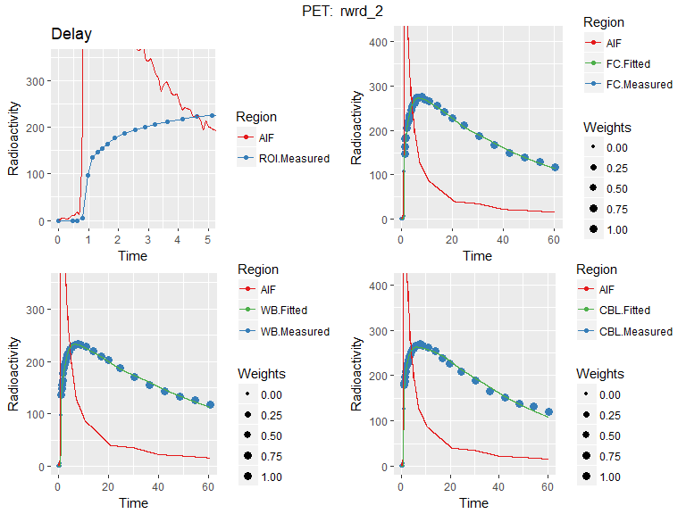
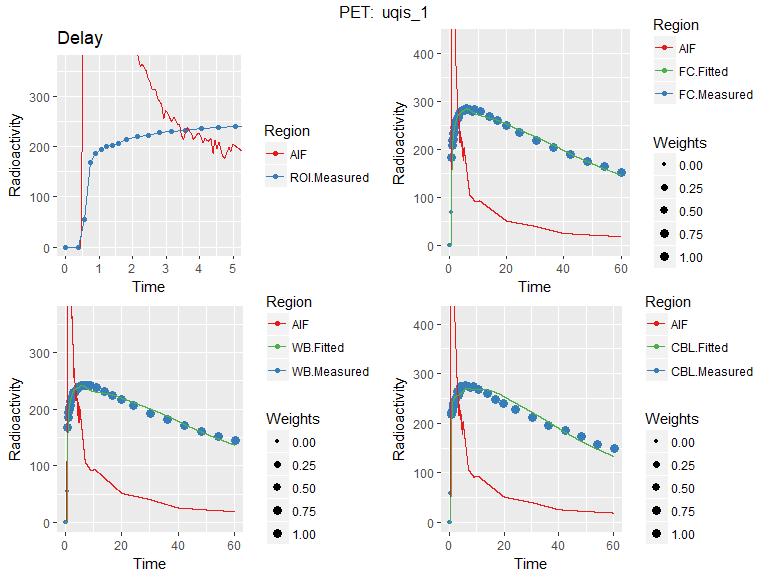

-   [Aims](#aims)
-   [Libraries](#libraries)
    -   [CRAN libraries](#cran-libraries)
    -   [Non-CRAN libraries](#non-cran-libraries)
-   [Demographic Data](#demographic-data)
    -   [Summary Statistics](#summary-statistics)
-   [TACs and Blood Data](#tacs-and-blood-data)
-   [Kinetic Modelling](#kinetic-modelling)
    -   [Fitting of the Delay and Blood Volume Fraction](#fitting-of-the-delay-and-blood-volume-fraction)
    -   [Rearrangement of the Data into Long Format](#rearrangement-of-the-data-into-long-format)
    -   [Define functions for fitting the models](#define-functions-for-fitting-the-models)
    -   [Fit all Kinetic Models](#fit-all-kinetic-models)
-   [Calculate Ratio Outcomes](#calculate-ratio-outcomes)
-   [Evaluate Spread and Test-Retest Metrics](#evaluate-spread-and-test-retest-metrics)
    -   [HABs and MABs together](#habs-and-mabs-together)
    -   [Separated by Genotype](#separated-by-genotype)
        -   [HABs](#habs)
        -   [MABs](#mabs)
    -   [Article Summary](#article-summary)
-   [Correlations with V<sub>T</sub>](#correlations-with-vt)
    -   [Plot of Ratio Associations with V<sub>T</sub>](#plot-of-ratio-associations-with-vt)
    -   [Plot Of Alternative Quantification Methods Associations with V<sub>T</sub>](#plot-of-alternative-quantification-methods-associations-with-vt)
-   [Interregional Correlation](#interregional-correlation)
    -   [Erratum Note:](#erratum-note)
-   [Principal Components Analysis](#principal-components-analysis)
    -   [PCA: All Regions](#pca-all-regions)
    -   [PCA: Only FC, WB and CBL](#pca-only-fc-wb-and-cbl)
-   [Plotting of 2TCM Model Fits](#plotting-of-2tcm-model-fits)
    -   [Included Participants](#included-participants)
    -   [Excluded Measurement](#excluded-measurement)
-   [vB Checking](#vb-checking)
-   [Session Info](#session-info)

Aims
====

The aims of this study were to evaluate the test-retest reliability, and validity (assessed by the relationship to V<sub>T</sub>) of the Standardised Uptake Value Ratio (SUVR) and Distribution Volume Ratio (DVR) of \[11C\]PBR28 in the frontal cortex (FC), using the whole brain (WB) and cerebellum (CBL) as reference regions (i.e. denominators). We also aim to examine the degree of association of binding estimates between regions of the brain.

Libraries
=========

CRAN libraries
--------------

First, the libraries for the analysis and plotting are loaded.

``` r
library(tidyverse)
library(stringr)
library(corrplot)
library(grid)
library(gridExtra)
library(RColorBrewer)
library(psych)
library(readxl)
library(pracma)
```

Non-CRAN libraries
------------------

The libraries above can be installed from CRAN. Those which cannot are installed as follows:

``` r
# install.packages("devtools")  # If you do not already have devtools
# devtools::install_github("mathesong/kinfitr", ref="v0.2.0")
# devtools::install_github("mathesong/granviller")
# devtools::install_github("mvuorre/vmisc")
# devtools::install_github('Rapporter/pander')

library(kinfitr)
library(vmisc)
library(pander)
```

Demographic Data
================

Here, the demographic data is loaded in.

``` r
demog <- read_excel('../RawData/TrT_chemistry_demograph.xlsx') %>%
  select(Subjname=Akronym, Gender=Sex, Age, Genotype, 
         PET_same_day, `MBq PET1`, `MBq PET2`, bodyMass=Weight_kg) %>%
  gather(PETNo, injRad, contains('MBq')) %>%
  mutate(PETNo = as.numeric(str_match(PETNo, '\\d'))) %>%
  mutate(PET = paste(Subjname, PETNo, sep='_'))
```

Summary Statistics
------------------

Below are presented some summary statistics of the demographic data.

``` r
demog %>%
  select(Age, InjectedRadioactivity = injRad) %>%
  describe() %>%
  pandoc.table(digits=3, caption = "Summary Statistics", split.tables=Inf)
```

<table>
<caption>Summary Statistics</caption>
<colgroup>
<col width="22%" />
<col width="5%" />
<col width="3%" />
<col width="5%" />
<col width="5%" />
<col width="7%" />
<col width="7%" />
<col width="5%" />
<col width="4%" />
<col width="4%" />
<col width="6%" />
<col width="7%" />
<col width="8%" />
<col width="5%" />
</colgroup>
<thead>
<tr class="header">
<th align="center"> </th>
<th align="center">vars</th>
<th align="center">n</th>
<th align="center">mean</th>
<th align="center">sd</th>
<th align="center">median</th>
<th align="center">trimmed</th>
<th align="center">mad</th>
<th align="center">min</th>
<th align="center">max</th>
<th align="center">range</th>
<th align="center">skew</th>
<th align="center">kurtosis</th>
<th align="center">se</th>
</tr>
</thead>
<tbody>
<tr class="odd">
<td align="center"><strong>Age</strong></td>
<td align="center">1</td>
<td align="center">24</td>
<td align="center">23.9</td>
<td align="center">2.99</td>
<td align="center">24</td>
<td align="center">23.8</td>
<td align="center">3.71</td>
<td align="center">20</td>
<td align="center">29</td>
<td align="center">9</td>
<td align="center">0.226</td>
<td align="center">-1.32</td>
<td align="center">0.611</td>
</tr>
<tr class="even">
<td align="center"><strong>InjectedRadioactivity</strong></td>
<td align="center">2</td>
<td align="center">24</td>
<td align="center">395</td>
<td align="center">51.7</td>
<td align="center">403</td>
<td align="center">401</td>
<td align="center">51.9</td>
<td align="center">248</td>
<td align="center">462</td>
<td align="center">214</td>
<td align="center">-0.997</td>
<td align="center">0.722</td>
<td align="center">10.6</td>
</tr>
</tbody>
</table>

``` r
counts <- demog %>%
  filter(PETNo==1)

pandoc.table(table(counts$Gender, counts$Genotype), caption = "Gender and Genotype")
```

<table style="width:29%;">
<caption>Gender and Genotype</caption>
<colgroup>
<col width="12%" />
<col width="8%" />
<col width="8%" />
</colgroup>
<thead>
<tr class="header">
<th align="center"> </th>
<th align="center">HAB</th>
<th align="center">MAB</th>
</tr>
</thead>
<tbody>
<tr class="odd">
<td align="center"><strong>F</strong></td>
<td align="center">2</td>
<td align="center">4</td>
</tr>
<tr class="even">
<td align="center"><strong>M</strong></td>
<td align="center">4</td>
<td align="center">2</td>
</tr>
</tbody>
</table>

TACs and Blood Data
===================

First, we must read in the TAC and blood data. It should be noted that the blood data is already dispersion corrected, and the plasma data is already metabolite corrected, thus the plasma fraction is set to 100% in the input data frame. It should also be noted that we set all negative values of both blood and plasma radioactivity concentrations to zero.

``` r
tacdat <- read_csv('../RawData/tacdata.csv') %>%
  group_by(PET) %>%
  nest(.key = 'tacs')

blooddat <- read_csv('../RawData/blooddata.csv') %>%
  mutate(Cbl.disp.corr = ifelse(Cbl.disp.corr < 0, 0, Cbl.disp.corr),
         Cpl..metabcorr. = ifelse(Cpl..metabcorr. < 0, 0, Cpl..metabcorr.)) %>%
  group_by(PET) %>%
  nest(.key='blooddata') %>%
  mutate(input = map(blooddata, ~blood_interp(
             t_blood = .x$ABSS.sec/60, blood=.x$Cbl.disp.corr, 
             t_plasma=.x$ABSS.sec/60, plasma=.x$Cpl..metabcorr., 
             t_parentfrac = 1, parentfrac=1 ) ))

dat <- inner_join(tacdat, blooddat) %>%
  separate(PET, c("Subjname", "PETNo"), sep='_', remove = F, convert=T)
```

Here, the TACs and blood data are merged with the demographic data.

``` r
datdf <- dat %>%
  inner_join(demog) %>%
  arrange(PET)
```

Kinetic Modelling
=================

Kinetic modelling is performed using the [kinfitr](https://github.com/mathesong/kinfitr) R package.

Fitting of the Delay and Blood Volume Fraction
----------------------------------------------

Here, the delay and blood bolume fraction are fitted using the whole brain ROI using 2TCM.

``` r
datdf <- datdf %>%
  group_by(PET) %>%
  mutate(WB_delay = map2(tacs, input, 
                         ~twotcm(t_tac = .x$Times/60, tac = .x$WB, input = .y, 
                                 frameStartEnd = c(1,33), inpshift.upper = 1))) %>%
  ungroup()
```

Rearrangement of the Data into Long Format
------------------------------------------

Here, the data is transformed from wide format (where each row represents one PET measurement) into long format (where each row represents one region of each PET measurement)

``` r
tacs <- datdf %>%
  select(PET, tacs, Subjname, PETNo) %>%
  unnest() %>%
  gather(Region, TAC, -(PET:Weights), -(StartTime:Duration)) %>%
  group_by(PET, Subjname, PETNo, Region) %>%
  nest() %>%
  rename(tacs=data)
  

longdat <- datdf %>%
  select(PET, Subjname, PETNo, input, WB_delay, bodyMass, injRad) %>%
  inner_join(tacs)
```

Define functions for fitting the models
---------------------------------------

Here we define functions for fitting each of the models.

``` r
# Total SUV
calcSUV <- function(tacs, bodymass, injRad) {
  SUV(t_tac = tacs$Times/60, 
         tac = tacs$TAC*0.037,    # To kBq - because of kg
         injRad = injRad,
         bodymass = bodymass,
         frameStartEnd=c(1,33))
}

# 40-60 Minute SUV
calcSUV_4060 <- function(SUVout) {
  
    interptime = seq(SUVout$tacs$Time[1], rev(SUVout$tacs$Time)[1], by=1/60)
    interptac  = interp1(x = SUVout$tacs$Time, SUVout$tacs$SUV, 
                                 xi = interptime, method = 'linear')
    step=interptime[2] - interptime[1]
    
    SUVdf <- data.frame(interptime, interptac) %>%
      filter(interptime > 40 & interptime <= 60)
    
    out <- mean(SUVdf$interptac)
    return(out)
}

# MA1 using the fitted delay and vB from delayFit
fitma1 <- function(tacs, input, delayFit) {
  ma1(t_tac = tacs$Times/60, tac = tacs$TAC, input = input, tstarIncludedFrames = 6,
      inpshift = delayFit$par$inpshift, frameStartEnd=c(1,33), weights=tacs$Weights,
      vB=delayFit$par$vB)
}

# 2TCM using the fitted delay and vB from delayFit
fit2tcm <- function(tacs, input, delayFit) {
  twotcm(t_tac = tacs$Times/60, tac = tacs$TAC, input = input, 
         inpshift = delayFit$par$inpshift, vB=delayFit$par$vB, 
         frameStartEnd=c(1,33), weights=tacs$Weights)
}
```

Fit all Kinetic Models
----------------------

Here, all kinetic models are fitted, and the V<sub>T</sub> values are extracted and added to the data frame.

``` r
longdat <- longdat %>%
  # SUV Total
  mutate(suvout_tot = pmap(list(tacs, bodyMass, injRad), calcSUV)) %>%
  mutate(SUV_tot = map_dbl(suvout_tot, c('par', 'intSUV'))) %>%
  
  # SUV 40-60 Minutes
  mutate(SUV_4060 = map_dbl(suvout_tot, calcSUV_4060)) %>%
  
  # MA1
  mutate(fit_ma1 = pmap(list(tacs, input, WB_delay), fitma1)) %>%
  mutate(Vt_ma1 = map_dbl(fit_ma1, c('par', 'Vt'))) %>%
    
  # 2TCM using fitted vB and delay
  mutate(fit_2tcm= pmap(list(tacs, input, WB_delay), fit2tcm)) %>%
  mutate(Vt_2tcm = map_dbl(fit_2tcm, c('par', 'Vt')))
```

Calculate Ratio Outcomes
========================

Here we calculate the Ratio Outcomes for SUV<sub>Total</sub>, SUV<sub>40-60</sub>, 2TCM and MA1.

``` r
trtdata <- longdat %>%
  select(Subjname, PETNo, Region, SUV_tot, SUV_4060, Vt_ma1, Vt_2tcm) %>%
  gather(Measure, Value, -Subjname, -PETNo, -Region) %>%
  spread(Region, Value) %>%
  mutate(FC_CBL = FC/CBL, FC_WB=FC/WB)
```

Evaluate Spread and Test-Retest Metrics
=======================================

Here we evaluate the spread and test-retest performance for all measures. Due to the influence of genotype, there are systematic differences between individuals. There are high-affinity binders (HABs) and medium-affinity binders (MABs) in this analysis. Thus, test-retest analyses are performed separately for HABs and MABs. Ratio-based outcome measures should account for genotype. Thus, we also performed test-retest analysis on all measurements together.

Note that SEM, the standard error of measurement, can be presented as an estimated standard error around each estimate (i.e. in the same units as the outcome), or as a percentage of the mean outcome like an estimate of the within-individual coefficient of variation. Here, due to differences in the scale of the outcome measures, it is presented as a percentage. This is why it is transformed from the original output.

HABs and MABs together
----------------------

``` r
trtout <- trtdata %>%
  gather(Region, Binding, -(Subjname:Measure)) %>%
  filter(Subjname != 'uqis') %>%
  spread(PETNo, Binding, drop = T) %>%
  group_by(Region, Measure) %>%
  do(trt = granviller::trt(.$`1`, .$`2`)$tidy) %>%
  ungroup() %>%
  unnest() %>%
  select(-se, -skew, -kurtosis, -md, -avgpercchange) %>%
  mutate('SEM %' = sem/mean*100,
         'COV %' = cov*100) %>%
  select(-sem, -cov) %>%
  arrange(Measure, Region) %>%
  add_column(Genotype='All', .after='Measure')

pandoc.table(trtout, digits=2, split.tables=Inf, 
             caption='Test-Retest Analysis for HABs and MABs together')
```

<table style="width:100%;">
<caption>Test-Retest Analysis for HABs and MABs together</caption>
<colgroup>
<col width="11%" />
<col width="14%" />
<col width="14%" />
<col width="9%" />
<col width="10%" />
<col width="9%" />
<col width="9%" />
<col width="10%" />
<col width="10%" />
</colgroup>
<thead>
<tr class="header">
<th align="center">Region</th>
<th align="center">Measure</th>
<th align="center">Genotype</th>
<th align="center">mean</th>
<th align="center">sd</th>
<th align="center">icc</th>
<th align="center">aapd</th>
<th align="center">SEM %</th>
<th align="center">COV %</th>
</tr>
</thead>
<tbody>
<tr class="odd">
<td align="center">CBL</td>
<td align="center">SUV_4060</td>
<td align="center">All</td>
<td align="center">0.98</td>
<td align="center">0.3</td>
<td align="center">0.9</td>
<td align="center">10</td>
<td align="center">9.4</td>
<td align="center">30</td>
</tr>
<tr class="even">
<td align="center">FC</td>
<td align="center">SUV_4060</td>
<td align="center">All</td>
<td align="center">0.92</td>
<td align="center">0.27</td>
<td align="center">0.88</td>
<td align="center">13</td>
<td align="center">10</td>
<td align="center">30</td>
</tr>
<tr class="odd">
<td align="center">FC_CBL</td>
<td align="center">SUV_4060</td>
<td align="center">All</td>
<td align="center">0.95</td>
<td align="center">0.059</td>
<td align="center">0.63</td>
<td align="center">4.4</td>
<td align="center">3.8</td>
<td align="center">6.2</td>
</tr>
<tr class="even">
<td align="center">FC_WB</td>
<td align="center">SUV_4060</td>
<td align="center">All</td>
<td align="center">1</td>
<td align="center">0.04</td>
<td align="center">0.89</td>
<td align="center">1.5</td>
<td align="center">1.3</td>
<td align="center">3.9</td>
</tr>
<tr class="odd">
<td align="center">STR</td>
<td align="center">SUV_4060</td>
<td align="center">All</td>
<td align="center">0.89</td>
<td align="center">0.27</td>
<td align="center">0.84</td>
<td align="center">16</td>
<td align="center">12</td>
<td align="center">31</td>
</tr>
<tr class="even">
<td align="center">TC</td>
<td align="center">SUV_4060</td>
<td align="center">All</td>
<td align="center">0.93</td>
<td align="center">0.27</td>
<td align="center">0.89</td>
<td align="center">11</td>
<td align="center">9.6</td>
<td align="center">29</td>
</tr>
<tr class="odd">
<td align="center">THA</td>
<td align="center">SUV_4060</td>
<td align="center">All</td>
<td align="center">1.2</td>
<td align="center">0.37</td>
<td align="center">0.87</td>
<td align="center">15</td>
<td align="center">11</td>
<td align="center">32</td>
</tr>
<tr class="even">
<td align="center">WB</td>
<td align="center">SUV_4060</td>
<td align="center">All</td>
<td align="center">0.9</td>
<td align="center">0.24</td>
<td align="center">0.86</td>
<td align="center">13</td>
<td align="center">10</td>
<td align="center">27</td>
</tr>
<tr class="odd">
<td align="center">CBL</td>
<td align="center">SUV_tot</td>
<td align="center">All</td>
<td align="center">80</td>
<td align="center">17</td>
<td align="center">0.83</td>
<td align="center">11</td>
<td align="center">8.8</td>
<td align="center">21</td>
</tr>
<tr class="even">
<td align="center">FC</td>
<td align="center">SUV_tot</td>
<td align="center">All</td>
<td align="center">78</td>
<td align="center">17</td>
<td align="center">0.8</td>
<td align="center">12</td>
<td align="center">9.5</td>
<td align="center">21</td>
</tr>
<tr class="odd">
<td align="center">FC_CBL</td>
<td align="center">SUV_tot</td>
<td align="center">All</td>
<td align="center">0.98</td>
<td align="center">0.045</td>
<td align="center">0.77</td>
<td align="center">2.5</td>
<td align="center">2.2</td>
<td align="center">4.6</td>
</tr>
<tr class="even">
<td align="center">FC_WB</td>
<td align="center">SUV_tot</td>
<td align="center">All</td>
<td align="center">1.1</td>
<td align="center">0.039</td>
<td align="center">0.9</td>
<td align="center">1.3</td>
<td align="center">1.1</td>
<td align="center">3.6</td>
</tr>
<tr class="odd">
<td align="center">STR</td>
<td align="center">SUV_tot</td>
<td align="center">All</td>
<td align="center">76</td>
<td align="center">17</td>
<td align="center">0.77</td>
<td align="center">14</td>
<td align="center">11</td>
<td align="center">22</td>
</tr>
<tr class="even">
<td align="center">TC</td>
<td align="center">SUV_tot</td>
<td align="center">All</td>
<td align="center">75</td>
<td align="center">15</td>
<td align="center">0.79</td>
<td align="center">12</td>
<td align="center">9.3</td>
<td align="center">20</td>
</tr>
<tr class="odd">
<td align="center">THA</td>
<td align="center">SUV_tot</td>
<td align="center">All</td>
<td align="center">92</td>
<td align="center">20</td>
<td align="center">0.74</td>
<td align="center">14</td>
<td align="center">11</td>
<td align="center">21</td>
</tr>
<tr class="even">
<td align="center">WB</td>
<td align="center">SUV_tot</td>
<td align="center">All</td>
<td align="center">72</td>
<td align="center">14</td>
<td align="center">0.75</td>
<td align="center">13</td>
<td align="center">9.7</td>
<td align="center">19</td>
</tr>
<tr class="odd">
<td align="center">CBL</td>
<td align="center">Vt_2tcm</td>
<td align="center">All</td>
<td align="center">3</td>
<td align="center">1.7</td>
<td align="center">0.93</td>
<td align="center">21</td>
<td align="center">15</td>
<td align="center">55</td>
</tr>
<tr class="even">
<td align="center">FC</td>
<td align="center">Vt_2tcm</td>
<td align="center">All</td>
<td align="center">2.9</td>
<td align="center">1.5</td>
<td align="center">0.93</td>
<td align="center">19</td>
<td align="center">14</td>
<td align="center">53</td>
</tr>
<tr class="odd">
<td align="center">FC_CBL</td>
<td align="center">Vt_2tcm</td>
<td align="center">All</td>
<td align="center">0.98</td>
<td align="center">0.07</td>
<td align="center">0.54</td>
<td align="center">4.7</td>
<td align="center">4.9</td>
<td align="center">7.1</td>
</tr>
<tr class="even">
<td align="center">FC_WB</td>
<td align="center">Vt_2tcm</td>
<td align="center">All</td>
<td align="center">1</td>
<td align="center">0.037</td>
<td align="center">0.52</td>
<td align="center">3</td>
<td align="center">2.5</td>
<td align="center">3.6</td>
</tr>
<tr class="odd">
<td align="center">STR</td>
<td align="center">Vt_2tcm</td>
<td align="center">All</td>
<td align="center">2.8</td>
<td align="center">1.5</td>
<td align="center">0.93</td>
<td align="center">19</td>
<td align="center">14</td>
<td align="center">53</td>
</tr>
<tr class="even">
<td align="center">TC</td>
<td align="center">Vt_2tcm</td>
<td align="center">All</td>
<td align="center">2.9</td>
<td align="center">1.6</td>
<td align="center">0.94</td>
<td align="center">19</td>
<td align="center">13</td>
<td align="center">54</td>
</tr>
<tr class="odd">
<td align="center">THA</td>
<td align="center">Vt_2tcm</td>
<td align="center">All</td>
<td align="center">3.8</td>
<td align="center">2.3</td>
<td align="center">0.93</td>
<td align="center">23</td>
<td align="center">16</td>
<td align="center">60</td>
</tr>
<tr class="even">
<td align="center">WB</td>
<td align="center">Vt_2tcm</td>
<td align="center">All</td>
<td align="center">2.8</td>
<td align="center">1.5</td>
<td align="center">0.93</td>
<td align="center">19</td>
<td align="center">14</td>
<td align="center">53</td>
</tr>
<tr class="odd">
<td align="center">CBL</td>
<td align="center">Vt_ma1</td>
<td align="center">All</td>
<td align="center">3.4</td>
<td align="center">1.8</td>
<td align="center">0.94</td>
<td align="center">18</td>
<td align="center">13</td>
<td align="center">53</td>
</tr>
<tr class="even">
<td align="center">FC</td>
<td align="center">Vt_ma1</td>
<td align="center">All</td>
<td align="center">3.1</td>
<td align="center">1.6</td>
<td align="center">0.93</td>
<td align="center">18</td>
<td align="center">14</td>
<td align="center">51</td>
</tr>
<tr class="odd">
<td align="center">FC_CBL</td>
<td align="center">Vt_ma1</td>
<td align="center">All</td>
<td align="center">0.93</td>
<td align="center">0.074</td>
<td align="center">0.62</td>
<td align="center">6.1</td>
<td align="center">4.9</td>
<td align="center">7.9</td>
</tr>
<tr class="even">
<td align="center">FC_WB</td>
<td align="center">Vt_ma1</td>
<td align="center">All</td>
<td align="center">1</td>
<td align="center">0.035</td>
<td align="center">0.86</td>
<td align="center">1.6</td>
<td align="center">1.3</td>
<td align="center">3.4</td>
</tr>
<tr class="odd">
<td align="center">STR</td>
<td align="center">Vt_ma1</td>
<td align="center">All</td>
<td align="center">3</td>
<td align="center">1.6</td>
<td align="center">0.93</td>
<td align="center">18</td>
<td align="center">14</td>
<td align="center">52</td>
</tr>
<tr class="even">
<td align="center">TC</td>
<td align="center">Vt_ma1</td>
<td align="center">All</td>
<td align="center">3.2</td>
<td align="center">1.6</td>
<td align="center">0.94</td>
<td align="center">17</td>
<td align="center">12</td>
<td align="center">52</td>
</tr>
<tr class="odd">
<td align="center">THA</td>
<td align="center">Vt_ma1</td>
<td align="center">All</td>
<td align="center">4.1</td>
<td align="center">2.4</td>
<td align="center">0.94</td>
<td align="center">21</td>
<td align="center">15</td>
<td align="center">58</td>
</tr>
<tr class="even">
<td align="center">WB</td>
<td align="center">Vt_ma1</td>
<td align="center">All</td>
<td align="center">3.1</td>
<td align="center">1.6</td>
<td align="center">0.93</td>
<td align="center">18</td>
<td align="center">14</td>
<td align="center">51</td>
</tr>
</tbody>
</table>

Separated by Genotype
---------------------

``` r
trtdata$Genotype <- ifelse(trtdata$Subjname %in% demog$Subjname[demog$Genotype=='HAB'], 
                           yes='HAB', no='MAB')

trtout_genotypes <- trtdata %>%
  gather(Region, Binding, -(Subjname:Measure), -Genotype) %>%
  filter(Subjname != 'uqis') %>%
  spread(PETNo, Binding) %>%
  group_by(Region, Measure, Genotype) %>%
  do(trt = granviller::trt(.$`1`, .$`2`)$tidy) %>%
  ungroup() %>%
  unnest() %>%
  select(-se, -skew, -kurtosis, -md, -avgpercchange) %>%
  mutate('SEM %' = sem/mean*100,
         'COV %' = cov*100) %>%
  select(-sem, -cov) %>%
  arrange(Measure, Region)
```

### HABs

``` r
hab_trtout <- filter(trtout_genotypes, Genotype=='HAB')
pandoc.table(hab_trtout, digits=2, split.tables=Inf, 
             caption='Test-Retest Analysis for HABs')
```

<table style="width:100%;">
<caption>Test-Retest Analysis for HABs</caption>
<colgroup>
<col width="11%" />
<col width="14%" />
<col width="14%" />
<col width="9%" />
<col width="10%" />
<col width="9%" />
<col width="9%" />
<col width="10%" />
<col width="10%" />
</colgroup>
<thead>
<tr class="header">
<th align="center">Region</th>
<th align="center">Measure</th>
<th align="center">Genotype</th>
<th align="center">mean</th>
<th align="center">sd</th>
<th align="center">icc</th>
<th align="center">aapd</th>
<th align="center">SEM %</th>
<th align="center">COV %</th>
</tr>
</thead>
<tbody>
<tr class="odd">
<td align="center">CBL</td>
<td align="center">SUV_4060</td>
<td align="center">HAB</td>
<td align="center">1.1</td>
<td align="center">0.27</td>
<td align="center">0.8</td>
<td align="center">13</td>
<td align="center">11</td>
<td align="center">24</td>
</tr>
<tr class="even">
<td align="center">FC</td>
<td align="center">SUV_4060</td>
<td align="center">HAB</td>
<td align="center">1.1</td>
<td align="center">0.24</td>
<td align="center">0.76</td>
<td align="center">13</td>
<td align="center">11</td>
<td align="center">22</td>
</tr>
<tr class="odd">
<td align="center">FC_CBL</td>
<td align="center">SUV_4060</td>
<td align="center">HAB</td>
<td align="center">0.94</td>
<td align="center">0.071</td>
<td align="center">0.85</td>
<td align="center">3.2</td>
<td align="center">2.9</td>
<td align="center">7.5</td>
</tr>
<tr class="even">
<td align="center">FC_WB</td>
<td align="center">SUV_4060</td>
<td align="center">HAB</td>
<td align="center">1</td>
<td align="center">0.019</td>
<td align="center">0.6</td>
<td align="center">1.3</td>
<td align="center">1.2</td>
<td align="center">1.9</td>
</tr>
<tr class="odd">
<td align="center">STR</td>
<td align="center">SUV_4060</td>
<td align="center">HAB</td>
<td align="center">1</td>
<td align="center">0.24</td>
<td align="center">0.74</td>
<td align="center">15</td>
<td align="center">12</td>
<td align="center">23</td>
</tr>
<tr class="even">
<td align="center">TC</td>
<td align="center">SUV_4060</td>
<td align="center">HAB</td>
<td align="center">1.1</td>
<td align="center">0.23</td>
<td align="center">0.77</td>
<td align="center">13</td>
<td align="center">10</td>
<td align="center">22</td>
</tr>
<tr class="odd">
<td align="center">THA</td>
<td align="center">SUV_4060</td>
<td align="center">HAB</td>
<td align="center">1.4</td>
<td align="center">0.32</td>
<td align="center">0.78</td>
<td align="center">14</td>
<td align="center">11</td>
<td align="center">24</td>
</tr>
<tr class="even">
<td align="center">WB</td>
<td align="center">SUV_4060</td>
<td align="center">HAB</td>
<td align="center">1</td>
<td align="center">0.22</td>
<td align="center">0.78</td>
<td align="center">12</td>
<td align="center">10</td>
<td align="center">21</td>
</tr>
<tr class="odd">
<td align="center">CBL</td>
<td align="center">SUV_tot</td>
<td align="center">HAB</td>
<td align="center">89</td>
<td align="center">15</td>
<td align="center">0.69</td>
<td align="center">11</td>
<td align="center">9.1</td>
<td align="center">16</td>
</tr>
<tr class="even">
<td align="center">FC</td>
<td align="center">SUV_tot</td>
<td align="center">HAB</td>
<td align="center">87</td>
<td align="center">12</td>
<td align="center">0.65</td>
<td align="center">9.9</td>
<td align="center">8.4</td>
<td align="center">14</td>
</tr>
<tr class="odd">
<td align="center">FC_CBL</td>
<td align="center">SUV_tot</td>
<td align="center">HAB</td>
<td align="center">0.99</td>
<td align="center">0.056</td>
<td align="center">0.96</td>
<td align="center">1.3</td>
<td align="center">1.1</td>
<td align="center">5.7</td>
</tr>
<tr class="even">
<td align="center">FC_WB</td>
<td align="center">SUV_tot</td>
<td align="center">HAB</td>
<td align="center">1.1</td>
<td align="center">0.02</td>
<td align="center">0.7</td>
<td align="center">1.2</td>
<td align="center">0.97</td>
<td align="center">1.8</td>
</tr>
<tr class="odd">
<td align="center">STR</td>
<td align="center">SUV_tot</td>
<td align="center">HAB</td>
<td align="center">85</td>
<td align="center">13</td>
<td align="center">0.62</td>
<td align="center">11</td>
<td align="center">9.1</td>
<td align="center">15</td>
</tr>
<tr class="even">
<td align="center">TC</td>
<td align="center">SUV_tot</td>
<td align="center">HAB</td>
<td align="center">83</td>
<td align="center">13</td>
<td align="center">0.63</td>
<td align="center">11</td>
<td align="center">9.3</td>
<td align="center">15</td>
</tr>
<tr class="odd">
<td align="center">THA</td>
<td align="center">SUV_tot</td>
<td align="center">HAB</td>
<td align="center">100</td>
<td align="center">16</td>
<td align="center">0.71</td>
<td align="center">9.6</td>
<td align="center">8.6</td>
<td align="center">16</td>
</tr>
<tr class="even">
<td align="center">WB</td>
<td align="center">SUV_tot</td>
<td align="center">HAB</td>
<td align="center">79</td>
<td align="center">12</td>
<td align="center">0.68</td>
<td align="center">10</td>
<td align="center">8.4</td>
<td align="center">15</td>
</tr>
<tr class="odd">
<td align="center">CBL</td>
<td align="center">Vt_2tcm</td>
<td align="center">HAB</td>
<td align="center">4</td>
<td align="center">1.8</td>
<td align="center">0.91</td>
<td align="center">19</td>
<td align="center">14</td>
<td align="center">44</td>
</tr>
<tr class="even">
<td align="center">FC</td>
<td align="center">Vt_2tcm</td>
<td align="center">HAB</td>
<td align="center">3.9</td>
<td align="center">1.6</td>
<td align="center">0.89</td>
<td align="center">21</td>
<td align="center">14</td>
<td align="center">42</td>
</tr>
<tr class="odd">
<td align="center">FC_CBL</td>
<td align="center">Vt_2tcm</td>
<td align="center">HAB</td>
<td align="center">0.97</td>
<td align="center">0.079</td>
<td align="center">0.87</td>
<td align="center">3.4</td>
<td align="center">2.9</td>
<td align="center">8.1</td>
</tr>
<tr class="even">
<td align="center">FC_WB</td>
<td align="center">Vt_2tcm</td>
<td align="center">HAB</td>
<td align="center">1.1</td>
<td align="center">0.031</td>
<td align="center">0.33</td>
<td align="center">3.1</td>
<td align="center">2.4</td>
<td align="center">3</td>
</tr>
<tr class="odd">
<td align="center">STR</td>
<td align="center">Vt_2tcm</td>
<td align="center">HAB</td>
<td align="center">3.6</td>
<td align="center">1.6</td>
<td align="center">0.92</td>
<td align="center">19</td>
<td align="center">13</td>
<td align="center">45</td>
</tr>
<tr class="even">
<td align="center">TC</td>
<td align="center">Vt_2tcm</td>
<td align="center">HAB</td>
<td align="center">3.9</td>
<td align="center">1.7</td>
<td align="center">0.92</td>
<td align="center">18</td>
<td align="center">12</td>
<td align="center">44</td>
</tr>
<tr class="odd">
<td align="center">THA</td>
<td align="center">Vt_2tcm</td>
<td align="center">HAB</td>
<td align="center">5.1</td>
<td align="center">2.5</td>
<td align="center">0.91</td>
<td align="center">24</td>
<td align="center">15</td>
<td align="center">49</td>
</tr>
<tr class="even">
<td align="center">WB</td>
<td align="center">Vt_2tcm</td>
<td align="center">HAB</td>
<td align="center">3.7</td>
<td align="center">1.6</td>
<td align="center">0.91</td>
<td align="center">20</td>
<td align="center">14</td>
<td align="center">44</td>
</tr>
<tr class="odd">
<td align="center">CBL</td>
<td align="center">Vt_ma1</td>
<td align="center">HAB</td>
<td align="center">4.5</td>
<td align="center">1.9</td>
<td align="center">0.92</td>
<td align="center">17</td>
<td align="center">12</td>
<td align="center">43</td>
</tr>
<tr class="even">
<td align="center">FC</td>
<td align="center">Vt_ma1</td>
<td align="center">HAB</td>
<td align="center">4.1</td>
<td align="center">1.7</td>
<td align="center">0.9</td>
<td align="center">20</td>
<td align="center">13</td>
<td align="center">42</td>
</tr>
<tr class="odd">
<td align="center">FC_CBL</td>
<td align="center">Vt_ma1</td>
<td align="center">HAB</td>
<td align="center">0.92</td>
<td align="center">0.078</td>
<td align="center">0.79</td>
<td align="center">4.8</td>
<td align="center">3.9</td>
<td align="center">8.5</td>
</tr>
<tr class="even">
<td align="center">FC_WB</td>
<td align="center">Vt_ma1</td>
<td align="center">HAB</td>
<td align="center">1</td>
<td align="center">0.026</td>
<td align="center">0.79</td>
<td align="center">1.6</td>
<td align="center">1.2</td>
<td align="center">2.6</td>
</tr>
<tr class="odd">
<td align="center">STR</td>
<td align="center">Vt_ma1</td>
<td align="center">HAB</td>
<td align="center">3.9</td>
<td align="center">1.7</td>
<td align="center">0.91</td>
<td align="center">22</td>
<td align="center">13</td>
<td align="center">43</td>
</tr>
<tr class="even">
<td align="center">TC</td>
<td align="center">Vt_ma1</td>
<td align="center">HAB</td>
<td align="center">4.1</td>
<td align="center">1.8</td>
<td align="center">0.93</td>
<td align="center">17</td>
<td align="center">11</td>
<td align="center">43</td>
</tr>
<tr class="odd">
<td align="center">THA</td>
<td align="center">Vt_ma1</td>
<td align="center">HAB</td>
<td align="center">5.4</td>
<td align="center">2.6</td>
<td align="center">0.91</td>
<td align="center">24</td>
<td align="center">14</td>
<td align="center">48</td>
</tr>
<tr class="even">
<td align="center">WB</td>
<td align="center">Vt_ma1</td>
<td align="center">HAB</td>
<td align="center">4</td>
<td align="center">1.7</td>
<td align="center">0.91</td>
<td align="center">20</td>
<td align="center">13</td>
<td align="center">43</td>
</tr>
</tbody>
</table>

### MABs

``` r
mab_trtout <- filter(trtout_genotypes, Genotype=='MAB')
pandoc.table(mab_trtout, digits=2, split.tables=Inf, 
             caption='Test-Retest Analysis for MABs')
```

<table style="width:100%;">
<caption>Test-Retest Analysis for MABs</caption>
<colgroup>
<col width="11%" />
<col width="14%" />
<col width="14%" />
<col width="9%" />
<col width="10%" />
<col width="9%" />
<col width="9%" />
<col width="10%" />
<col width="10%" />
</colgroup>
<thead>
<tr class="header">
<th align="center">Region</th>
<th align="center">Measure</th>
<th align="center">Genotype</th>
<th align="center">mean</th>
<th align="center">sd</th>
<th align="center">icc</th>
<th align="center">aapd</th>
<th align="center">SEM %</th>
<th align="center">COV %</th>
</tr>
</thead>
<tbody>
<tr class="odd">
<td align="center">CBL</td>
<td align="center">SUV_4060</td>
<td align="center">MAB</td>
<td align="center">0.84</td>
<td align="center">0.25</td>
<td align="center">0.95</td>
<td align="center">7.3</td>
<td align="center">6.3</td>
<td align="center">30</td>
</tr>
<tr class="even">
<td align="center">FC</td>
<td align="center">SUV_4060</td>
<td align="center">MAB</td>
<td align="center">0.8</td>
<td align="center">0.24</td>
<td align="center">0.91</td>
<td align="center">13</td>
<td align="center">9.1</td>
<td align="center">31</td>
</tr>
<tr class="odd">
<td align="center">FC_CBL</td>
<td align="center">SUV_4060</td>
<td align="center">MAB</td>
<td align="center">0.95</td>
<td align="center">0.05</td>
<td align="center">0.32</td>
<td align="center">5.4</td>
<td align="center">4.3</td>
<td align="center">5.2</td>
</tr>
<tr class="even">
<td align="center">FC_WB</td>
<td align="center">SUV_4060</td>
<td align="center">MAB</td>
<td align="center">1</td>
<td align="center">0.041</td>
<td align="center">0.89</td>
<td align="center">1.6</td>
<td align="center">1.3</td>
<td align="center">4</td>
</tr>
<tr class="odd">
<td align="center">STR</td>
<td align="center">SUV_4060</td>
<td align="center">MAB</td>
<td align="center">0.77</td>
<td align="center">0.24</td>
<td align="center">0.87</td>
<td align="center">16</td>
<td align="center">11</td>
<td align="center">31</td>
</tr>
<tr class="even">
<td align="center">TC</td>
<td align="center">SUV_4060</td>
<td align="center">MAB</td>
<td align="center">0.8</td>
<td align="center">0.24</td>
<td align="center">0.93</td>
<td align="center">9.9</td>
<td align="center">7.7</td>
<td align="center">30</td>
</tr>
<tr class="odd">
<td align="center">THA</td>
<td align="center">SUV_4060</td>
<td align="center">MAB</td>
<td align="center">1</td>
<td align="center">0.36</td>
<td align="center">0.9</td>
<td align="center">16</td>
<td align="center">11</td>
<td align="center">35</td>
</tr>
<tr class="even">
<td align="center">WB</td>
<td align="center">SUV_4060</td>
<td align="center">MAB</td>
<td align="center">0.79</td>
<td align="center">0.22</td>
<td align="center">0.87</td>
<td align="center">13</td>
<td align="center">9.7</td>
<td align="center">27</td>
</tr>
<tr class="odd">
<td align="center">CBL</td>
<td align="center">SUV_tot</td>
<td align="center">MAB</td>
<td align="center">72</td>
<td align="center">16</td>
<td align="center">0.86</td>
<td align="center">11</td>
<td align="center">8</td>
<td align="center">21</td>
</tr>
<tr class="even">
<td align="center">FC</td>
<td align="center">SUV_tot</td>
<td align="center">MAB</td>
<td align="center">71</td>
<td align="center">16</td>
<td align="center">0.8</td>
<td align="center">14</td>
<td align="center">10</td>
<td align="center">23</td>
</tr>
<tr class="odd">
<td align="center">FC_CBL</td>
<td align="center">SUV_tot</td>
<td align="center">MAB</td>
<td align="center">0.98</td>
<td align="center">0.037</td>
<td align="center">0.45</td>
<td align="center">3.5</td>
<td align="center">2.8</td>
<td align="center">3.8</td>
</tr>
<tr class="even">
<td align="center">FC_WB</td>
<td align="center">SUV_tot</td>
<td align="center">MAB</td>
<td align="center">1.1</td>
<td align="center">0.038</td>
<td align="center">0.89</td>
<td align="center">1.4</td>
<td align="center">1.2</td>
<td align="center">3.6</td>
</tr>
<tr class="odd">
<td align="center">STR</td>
<td align="center">SUV_tot</td>
<td align="center">MAB</td>
<td align="center">69</td>
<td align="center">17</td>
<td align="center">0.77</td>
<td align="center">17</td>
<td align="center">12</td>
<td align="center">25</td>
</tr>
<tr class="even">
<td align="center">TC</td>
<td align="center">SUV_tot</td>
<td align="center">MAB</td>
<td align="center">69</td>
<td align="center">15</td>
<td align="center">0.83</td>
<td align="center">12</td>
<td align="center">8.9</td>
<td align="center">22</td>
</tr>
<tr class="odd">
<td align="center">THA</td>
<td align="center">SUV_tot</td>
<td align="center">MAB</td>
<td align="center">86</td>
<td align="center">21</td>
<td align="center">0.73</td>
<td align="center">17</td>
<td align="center">13</td>
<td align="center">24</td>
</tr>
<tr class="even">
<td align="center">WB</td>
<td align="center">SUV_tot</td>
<td align="center">MAB</td>
<td align="center">67</td>
<td align="center">14</td>
<td align="center">0.74</td>
<td align="center">15</td>
<td align="center">11</td>
<td align="center">21</td>
</tr>
<tr class="odd">
<td align="center">CBL</td>
<td align="center">Vt_2tcm</td>
<td align="center">MAB</td>
<td align="center">2.2</td>
<td align="center">1</td>
<td align="center">0.9</td>
<td align="center">22</td>
<td align="center">15</td>
<td align="center">48</td>
</tr>
<tr class="even">
<td align="center">FC</td>
<td align="center">Vt_2tcm</td>
<td align="center">MAB</td>
<td align="center">2.2</td>
<td align="center">0.99</td>
<td align="center">0.93</td>
<td align="center">17</td>
<td align="center">12</td>
<td align="center">46</td>
</tr>
<tr class="odd">
<td align="center">FC_CBL</td>
<td align="center">Vt_2tcm</td>
<td align="center">MAB</td>
<td align="center">0.99</td>
<td align="center">0.065</td>
<td align="center">0.17</td>
<td align="center">5.9</td>
<td align="center">6</td>
<td align="center">6.6</td>
</tr>
<tr class="even">
<td align="center">FC_WB</td>
<td align="center">Vt_2tcm</td>
<td align="center">MAB</td>
<td align="center">1</td>
<td align="center">0.038</td>
<td align="center">0.55</td>
<td align="center">2.9</td>
<td align="center">2.5</td>
<td align="center">3.7</td>
</tr>
<tr class="odd">
<td align="center">STR</td>
<td align="center">Vt_2tcm</td>
<td align="center">MAB</td>
<td align="center">2</td>
<td align="center">0.8</td>
<td align="center">0.86</td>
<td align="center">18</td>
<td align="center">15</td>
<td align="center">40</td>
</tr>
<tr class="even">
<td align="center">TC</td>
<td align="center">Vt_2tcm</td>
<td align="center">MAB</td>
<td align="center">2.1</td>
<td align="center">1</td>
<td align="center">0.92</td>
<td align="center">21</td>
<td align="center">13</td>
<td align="center">47</td>
</tr>
<tr class="odd">
<td align="center">THA</td>
<td align="center">Vt_2tcm</td>
<td align="center">MAB</td>
<td align="center">2.8</td>
<td align="center">1.5</td>
<td align="center">0.93</td>
<td align="center">22</td>
<td align="center">15</td>
<td align="center">54</td>
</tr>
<tr class="even">
<td align="center">WB</td>
<td align="center">Vt_2tcm</td>
<td align="center">MAB</td>
<td align="center">2.1</td>
<td align="center">0.94</td>
<td align="center">0.92</td>
<td align="center">18</td>
<td align="center">13</td>
<td align="center">45</td>
</tr>
<tr class="odd">
<td align="center">CBL</td>
<td align="center">Vt_ma1</td>
<td align="center">MAB</td>
<td align="center">2.5</td>
<td align="center">1.1</td>
<td align="center">0.92</td>
<td align="center">19</td>
<td align="center">12</td>
<td align="center">43</td>
</tr>
<tr class="even">
<td align="center">FC</td>
<td align="center">Vt_ma1</td>
<td align="center">MAB</td>
<td align="center">2.3</td>
<td align="center">0.95</td>
<td align="center">0.92</td>
<td align="center">16</td>
<td align="center">12</td>
<td align="center">41</td>
</tr>
<tr class="odd">
<td align="center">FC_CBL</td>
<td align="center">Vt_ma1</td>
<td align="center">MAB</td>
<td align="center">0.94</td>
<td align="center">0.071</td>
<td align="center">0.48</td>
<td align="center">7.1</td>
<td align="center">5.4</td>
<td align="center">7.5</td>
</tr>
<tr class="even">
<td align="center">FC_WB</td>
<td align="center">Vt_ma1</td>
<td align="center">MAB</td>
<td align="center">1</td>
<td align="center">0.04</td>
<td align="center">0.89</td>
<td align="center">1.6</td>
<td align="center">1.3</td>
<td align="center">3.9</td>
</tr>
<tr class="odd">
<td align="center">STR</td>
<td align="center">Vt_ma1</td>
<td align="center">MAB</td>
<td align="center">2.3</td>
<td align="center">0.95</td>
<td align="center">0.9</td>
<td align="center">16</td>
<td align="center">13</td>
<td align="center">42</td>
</tr>
<tr class="even">
<td align="center">TC</td>
<td align="center">Vt_ma1</td>
<td align="center">MAB</td>
<td align="center">2.3</td>
<td align="center">0.99</td>
<td align="center">0.93</td>
<td align="center">16</td>
<td align="center">12</td>
<td align="center">42</td>
</tr>
<tr class="odd">
<td align="center">THA</td>
<td align="center">Vt_ma1</td>
<td align="center">MAB</td>
<td align="center">3</td>
<td align="center">1.5</td>
<td align="center">0.93</td>
<td align="center">19</td>
<td align="center">13</td>
<td align="center">51</td>
</tr>
<tr class="even">
<td align="center">WB</td>
<td align="center">Vt_ma1</td>
<td align="center">MAB</td>
<td align="center">2.3</td>
<td align="center">0.91</td>
<td align="center">0.91</td>
<td align="center">16</td>
<td align="center">12</td>
<td align="center">40</td>
</tr>
</tbody>
</table>

Article Summary
---------------

``` r
summary_trtout <- bind_rows(list(trtout, hab_trtout, mab_trtout)) %>%
  arrange(rev(Measure), Region, Genotype) %>%
  filter(Region %in% c("FC", "FC_WB", "FC_CBL")) %>%
  filter(Measure %in% c("Vt_2tcm", "SUV_4060")) %>%
  #separate(Region, c("Region", "Denominator"), sep = '_')
  mutate(Denominator = str_match(Region, '_(.*)')[,2]) %>%
  select(Measure, Genotype, Denominator=Denominator, Mean=mean, `COV %`, 
         ICC=icc, VAR=aapd, `SEM %`) %>%
  mutate(Measure = ifelse(Measure=='Vt_2tcm', 'V~T-2TCM~', 'SUV~40-60min~')) %>%
  filter(!(Denominator=='-' & Genotype=='All')) %>%
  replace_na(list(Denominator='-'))


pandoc.table(summary_trtout, digits=2, split.tables=Inf, 
             caption='Test-Retest Table for Article')
```

<table style="width:100%;">
<caption>Test-Retest Table for Article</caption>
<colgroup>
<col width="21%" />
<col width="14%" />
<col width="18%" />
<col width="9%" />
<col width="10%" />
<col width="9%" />
<col width="7%" />
<col width="9%" />
</colgroup>
<thead>
<tr class="header">
<th align="center">Measure</th>
<th align="center">Genotype</th>
<th align="center">Denominator</th>
<th align="center">Mean</th>
<th align="center">COV %</th>
<th align="center">ICC</th>
<th align="center">VAR</th>
<th align="center">SEM %</th>
</tr>
</thead>
<tbody>
<tr class="odd">
<td align="center">V<sub>T-2TCM</sub></td>
<td align="center">HAB</td>
<td align="center">-</td>
<td align="center">3.9</td>
<td align="center">42</td>
<td align="center">0.89</td>
<td align="center">21</td>
<td align="center">14</td>
</tr>
<tr class="even">
<td align="center">V<sub>T-2TCM</sub></td>
<td align="center">MAB</td>
<td align="center">-</td>
<td align="center">2.2</td>
<td align="center">46</td>
<td align="center">0.93</td>
<td align="center">17</td>
<td align="center">12</td>
</tr>
<tr class="odd">
<td align="center">V<sub>T-2TCM</sub></td>
<td align="center">All</td>
<td align="center">CBL</td>
<td align="center">0.98</td>
<td align="center">7.1</td>
<td align="center">0.54</td>
<td align="center">4.7</td>
<td align="center">4.9</td>
</tr>
<tr class="even">
<td align="center">V<sub>T-2TCM</sub></td>
<td align="center">HAB</td>
<td align="center">CBL</td>
<td align="center">0.97</td>
<td align="center">8.1</td>
<td align="center">0.87</td>
<td align="center">3.4</td>
<td align="center">2.9</td>
</tr>
<tr class="odd">
<td align="center">V<sub>T-2TCM</sub></td>
<td align="center">MAB</td>
<td align="center">CBL</td>
<td align="center">0.99</td>
<td align="center">6.6</td>
<td align="center">0.17</td>
<td align="center">5.9</td>
<td align="center">6</td>
</tr>
<tr class="even">
<td align="center">V<sub>T-2TCM</sub></td>
<td align="center">All</td>
<td align="center">WB</td>
<td align="center">1</td>
<td align="center">3.6</td>
<td align="center">0.52</td>
<td align="center">3</td>
<td align="center">2.5</td>
</tr>
<tr class="odd">
<td align="center">V<sub>T-2TCM</sub></td>
<td align="center">HAB</td>
<td align="center">WB</td>
<td align="center">1.1</td>
<td align="center">3</td>
<td align="center">0.33</td>
<td align="center">3.1</td>
<td align="center">2.4</td>
</tr>
<tr class="even">
<td align="center">V<sub>T-2TCM</sub></td>
<td align="center">MAB</td>
<td align="center">WB</td>
<td align="center">1</td>
<td align="center">3.7</td>
<td align="center">0.55</td>
<td align="center">2.9</td>
<td align="center">2.5</td>
</tr>
<tr class="odd">
<td align="center">SUV<sub>40-60min</sub></td>
<td align="center">HAB</td>
<td align="center">-</td>
<td align="center">1.1</td>
<td align="center">22</td>
<td align="center">0.76</td>
<td align="center">13</td>
<td align="center">11</td>
</tr>
<tr class="even">
<td align="center">SUV<sub>40-60min</sub></td>
<td align="center">MAB</td>
<td align="center">-</td>
<td align="center">0.8</td>
<td align="center">31</td>
<td align="center">0.91</td>
<td align="center">13</td>
<td align="center">9.1</td>
</tr>
<tr class="odd">
<td align="center">SUV<sub>40-60min</sub></td>
<td align="center">All</td>
<td align="center">CBL</td>
<td align="center">0.95</td>
<td align="center">6.2</td>
<td align="center">0.63</td>
<td align="center">4.4</td>
<td align="center">3.8</td>
</tr>
<tr class="even">
<td align="center">SUV<sub>40-60min</sub></td>
<td align="center">HAB</td>
<td align="center">CBL</td>
<td align="center">0.94</td>
<td align="center">7.5</td>
<td align="center">0.85</td>
<td align="center">3.2</td>
<td align="center">2.9</td>
</tr>
<tr class="odd">
<td align="center">SUV<sub>40-60min</sub></td>
<td align="center">MAB</td>
<td align="center">CBL</td>
<td align="center">0.95</td>
<td align="center">5.2</td>
<td align="center">0.32</td>
<td align="center">5.4</td>
<td align="center">4.3</td>
</tr>
<tr class="even">
<td align="center">SUV<sub>40-60min</sub></td>
<td align="center">All</td>
<td align="center">WB</td>
<td align="center">1</td>
<td align="center">3.9</td>
<td align="center">0.89</td>
<td align="center">1.5</td>
<td align="center">1.3</td>
</tr>
<tr class="odd">
<td align="center">SUV<sub>40-60min</sub></td>
<td align="center">HAB</td>
<td align="center">WB</td>
<td align="center">1</td>
<td align="center">1.9</td>
<td align="center">0.6</td>
<td align="center">1.3</td>
<td align="center">1.2</td>
</tr>
<tr class="even">
<td align="center">SUV<sub>40-60min</sub></td>
<td align="center">MAB</td>
<td align="center">WB</td>
<td align="center">1</td>
<td align="center">4</td>
<td align="center">0.89</td>
<td align="center">1.6</td>
<td align="center">1.3</td>
</tr>
</tbody>
</table>

Correlations with V<sub>T</sub>
===============================

Here, the data is arranged for assessment of the correlation with V<sub>T</sub>

``` r
plotdat <- trtdata %>%
  select(-CBL, -(STR:WB)) %>%
  filter(Measure != 'SUV_tot') %>%
  gather(Region, Value, -(Subjname:Measure), -Genotype) %>%
  #mutate(Region = str_replace(Region, 'FC', replacement = '')) %>%
  unite(Outcome, Measure, Region) %>%
  spread(Outcome, Value) %>%
  mutate(PET = paste(Subjname, PETNo, sep='_')) %>%
  filter(PET != 'uqis_2')
```

Here, correlations with 2TCM V<sub>T</sub> are calculated.

``` r
corout <- plotdat %>%
  gather(Measure, Binding, -PET, -(Subjname:Genotype), -Vt_2tcm_FC) %>%
  group_by(Measure, Genotype) %>%
  summarise('R^2^'=cor(Binding, Vt_2tcm_FC)^2) %>%
  arrange(Measure, Genotype) %>%
  ungroup() %>%
  mutate(Measure = str_replace(string=Measure, pattern='_FC', replacement='')) %>%
  mutate(Measure = str_replace(string=Measure, pattern='_4060', replacement='')) %>%
  mutate(Measure = str_replace(string=Measure, pattern='_', replacement='~')) %>%
  mutate(Measure = str_replace(string=Measure, pattern='CBL', replacement='CBL~')) %>%
  mutate(Measure = str_replace(string=Measure, pattern='WB', replacement='WB~')) %>%
  mutate(Measure = str_replace(string=Measure, pattern='Vt~2tcm_', replacement='DVR~')) %>%
  filter(!str_detect(Measure, '~ma1_')) %>%
  mutate(Measure = str_replace(string=Measure, pattern='Vt~ma1', replacement='V~T-MA1~'))

pandoc.table(corout, digits=2, split.tables=Inf, caption="Correlations with V~T~")
```

<table style="width:42%;">
<caption>Correlations with V<sub>T</sub></caption>
<colgroup>
<col width="15%" />
<col width="15%" />
<col width="11%" />
</colgroup>
<thead>
<tr class="header">
<th align="center">Measure</th>
<th align="center">Genotype</th>
<th align="center">R<sup>2</sup></th>
</tr>
</thead>
<tbody>
<tr class="odd">
<td align="center">SUV</td>
<td align="center">HAB</td>
<td align="center">0.64</td>
</tr>
<tr class="even">
<td align="center">SUV</td>
<td align="center">MAB</td>
<td align="center">0.86</td>
</tr>
<tr class="odd">
<td align="center">SUV<sub>CBL</sub></td>
<td align="center">HAB</td>
<td align="center">0.0046</td>
</tr>
<tr class="even">
<td align="center">SUV<sub>CBL</sub></td>
<td align="center">MAB</td>
<td align="center">0.0034</td>
</tr>
<tr class="odd">
<td align="center">SUV<sub>WB</sub></td>
<td align="center">HAB</td>
<td align="center">0.0061</td>
</tr>
<tr class="even">
<td align="center">SUV<sub>WB</sub></td>
<td align="center">MAB</td>
<td align="center">0.33</td>
</tr>
<tr class="odd">
<td align="center">DVR<sub>CBL</sub></td>
<td align="center">HAB</td>
<td align="center">0.022</td>
</tr>
<tr class="even">
<td align="center">DVR<sub>CBL</sub></td>
<td align="center">MAB</td>
<td align="center">0.034</td>
</tr>
<tr class="odd">
<td align="center">DVR<sub>WB</sub></td>
<td align="center">HAB</td>
<td align="center">0.3</td>
</tr>
<tr class="even">
<td align="center">DVR<sub>WB</sub></td>
<td align="center">MAB</td>
<td align="center">0.0056</td>
</tr>
<tr class="odd">
<td align="center">V<sub>T-MA1</sub></td>
<td align="center">HAB</td>
<td align="center">0.99</td>
</tr>
<tr class="even">
<td align="center">V<sub>T-MA1</sub></td>
<td align="center">MAB</td>
<td align="center">0.99</td>
</tr>
</tbody>
</table>

Plot of Ratio Associations with V<sub>T</sub>
---------------------------------------------

``` r
longplotdat <- plotdat %>%
  gather(Measure, Binding, -PET, -(Subjname:Genotype), -Vt_2tcm_FC) %>%
  group_by(Measure) %>%
  nest() %>%
  mutate(outplot = map(data, 
                        ~ggplot(.x, aes(x=Vt_2tcm_FC, y=Binding, colour=Genotype)) +
                          geom_point() + theme_blog() + 
                          geom_line(aes(group=Subjname), linetype="dotted") +
                          theme(axis.title.y=element_blank(),
                          plot.background = element_rect(fill = "white")) +
                          scale_color_brewer(palette = 'Set1') + 
                          geom_smooth(method="lm", se=F)))

# SUVWB
a <- longplotdat$outplot[[which(longplotdat$Measure=='SUV_4060_FC_WB')]] + 
  expand_limits(x=0,y=c(0.95,1.1)) + 
  labs(x=expression(V[T]),
       y=expression(SUVR[WB])) +
   theme(axis.title.x=element_blank())

# SUVCBL
b <- longplotdat$outplot[[which(longplotdat$Measure=='SUV_4060_FC_CBL')]] + 
  expand_limits(x=0,y=c(0.8,1.1)) +
  labs(x=expression(V[T]),
       y=expression(SUVR[CBL]))  +
   theme(axis.title.x=element_blank())

# DVRWB
c <- longplotdat$outplot[[which(longplotdat$Measure=='Vt_2tcm_FC_WB')]] + 
  expand_limits(x=0,y=c(0.95,1.1)) + 
  labs(x=expression(paste('Frontal Cortex ',V[T])),
       y=expression(DVR[WB]))

# DVRCBL
d <- longplotdat$outplot[[which(longplotdat$Measure=='Vt_2tcm_FC_CBL')]] + 
  expand_limits(x=0,y=c(0.8,1.1)) + 
  labs(x=expression(paste('Frontal Cortex ',V[T])),
       y=expression(DVR[CBL]))

# Text Labels
e = textGrob(label = 'SUVR')
f = textGrob(label = 'DVR')
g = textGrob(label = '     Whole Brain')
h = textGrob(label = '     Cerebellum')

# Legend
g_legend<-function(a.gplot){
  tmp <- ggplot_gtable(ggplot_build(a.gplot))
  leg <- which(sapply(tmp$grobs, function(x) x$name) == "guide-box")
  legend <- tmp$grobs[[leg]]
  legend
}

a2 <- ggplot(plotdat, aes(x=Vt_2tcm_FC, y=SUV_4060_FC_WB, colour=Genotype)) + 
  geom_point() + theme_bw() +
  scale_color_brewer('Genotype', palette = 'Set1')

genlegend <- g_legend(a2)

layout <- rbind(c(NA, 7, 8, 9 ),
                c(1, 2, 3, 9),
                c(4, 5, 6, 9))

grid.arrange(grobs=list(e,a,b,f,c,d,g,h, genlegend), 
                        layout_matrix=layout, widths=c(1,4,4,2), heights=c(1,4,5))
```


Plot Of Alternative Quantification Methods Associations with V<sub>T</sub>
--------------------------------------------------------------------------

``` r
# MA1
Vta <- longplotdat$outplot[[which(longplotdat$Measure=='Vt_ma1_FC')]] + 
  labs(x=expression(paste('2TCM Frontal Cortex ',V[T])),
       y=expression(paste('MA1 Frontal Cortex ',V[T]))) +
  theme(axis.title.x=element_blank()) +
  scale_y_continuous(breaks=seq(1,8,by=0.5)) +
  geom_abline(slope = 1, linetype='dashed')
  
Vtb <- longplotdat$outplot[[which(longplotdat$Measure=='SUV_4060_FC')]] + 
  labs(x=expression(paste('2TCM Frontal Cortex ',V[T])),
       y=expression(paste('Frontal Cortex ',SUVV[40-60]))) +
  scale_y_continuous(breaks=seq(0.5,1.6,by=0.1))

# Text
alabel <- textGrob(label = expression(paste('MA1 FC ',V[T])))
blabel <- textGrob(label = expression(paste('FC ',SUV[40-60])))

layout2 <- rbind(c(3, 1, 5),
                 c(4, 2, 5))

grid.arrange(grobs=list(Vta, Vtb, alabel, blabel, genlegend), 
             layout_matrix=layout2, widths=c(2,4,2), heights=c(4,5))
```


``` r
longdat <- longdat %>%
  inner_join(select(demog, PET, Genotype))
```

    ## Joining, by = "PET"

``` r
# SUV
SUV_genotype <- ggplot(plotdat, aes(x=Vt_2tcm_FC, y=SUV_4060_FC, colour=Genotype)) + 
  geom_point() + theme_blog() + 
  geom_line(aes(group=Subjname), linetype="dotted") +
  labs(x=expression(paste('2TCM ',V[T])),
       y=expression(paste('',SUV[40-60])),
       title='Frontal Cortex',
       subtitle='Coloured by Genotype') +
  theme(plot.background = element_rect(fill = "white")) +
  scale_y_continuous(breaks=seq(0.5,1.6,by=0.1)) +
  scale_color_brewer(palette = 'Set1') + geom_smooth(method="lm", se=F) +
  theme(plot.title = element_text(hjust = 0.5),
        plot.subtitle = element_text(hjust = 0.5))

SUV_subject <- longdat %>% 
  filter(PET != 'uqis_2') %>%
  ggplot(aes(x=Vt_2tcm, y=SUV_4060, colour=Subjname, shape=Genotype, linetype=Genotype)) + 
  geom_point() + theme_blog() + 
  labs(x=expression(paste('2TCM ',V[T])),
       y=expression(paste('',SUV[40-60])),
       title='All Regions',
       subtitle='Coloured by Participant') +
  theme(plot.background = element_rect(fill = "white")) +
  geom_smooth(method="lm", se=F) +
  theme(plot.title = element_text(hjust = 0.5),
        plot.subtitle = element_text(hjust = 0.5))


subjleg <-  g_legend( SUV_subject + 
                        theme_bw() +  
                        scale_colour_discrete(guide = FALSE) + 
                        geom_smooth(colour="black", fill=NA) )
```

    ## `geom_smooth()` using method = 'loess'

``` r
grid.arrange(grobs=list(SUV_genotype, genlegend, SUV_subject, subjleg), ncol=2, heights=c(12,12), widths=c(6,1))
```


Interregional Correlation
=========================

Here the interregional correlations for V<sub>T</sub> and for SUV are assessed

``` r
VT_2tcm <- longdat %>%
  select(PET, Genotype, Region, Vt_2tcm) %>%
  spread(Region, Vt_2tcm)

SUV_4060 <- longdat %>%
  select(PET, Genotype, Region, SUV_4060) %>%
  spread(Region, SUV_4060)

col2 <- colorRampPalette(rev(c("#67001F", "#B2182B", "#D6604D", "#F4A582", "#FDDBC7",
                           "#FFFFFF", "#D1E5F0", "#92C5DE", "#4393C3", "#2166AC", "#053061")))

par(mfrow=c(2,2))
VT_2tcm %>%
  filter(Genotype=='HAB') %>%
  select(CBL:WB) %>%
  cor() %>%
  corrplot.mixed(lower='ellipse', upper='number', 
                 col=col2(200), diag='n',
                 number.digits = 2, title=expression(HAB ~ V[T] ~ Correlations),
                 mar=c(0,0,1,0))

VT_2tcm %>%
  filter(Genotype=='MAB') %>%
  select(CBL:WB) %>%
  cor() %>%
  corrplot.mixed(lower='ellipse', upper='number', 
                 col=col2(200), diag='n',
                 number.digits = 2, , title=expression(MAB ~ V[T] ~ Correlations),
                 mar=c(0,0,1,0))

SUV_4060 %>%
  filter(Genotype=='HAB') %>%
  select(CBL:WB) %>%
  cor() %>%
  corrplot.mixed(lower='ellipse', upper='number', 
                 col=col2(200), diag='n',
                 number.digits = 2, title=expression(HAB ~ SUV ~ Correlations),
                 mar=c(0,0,1,0))

SUV_4060 %>%
  filter(Genotype=='MAB') %>%
  select(CBL:WB) %>%
  cor() %>%
  corrplot.mixed(lower='ellipse', upper='number', 
                 col=col2(200), diag='n',
                 number.digits = 2, title=expression(MAB ~ SUV ~ Correlations),
                 mar=c(0,0,1,0))
```


#### Erratum Note:

Please note that there are some small discrepancies between figure 1 in the paper and the figure above, because an older version of figure 1 was accidentally submitted for publication. The submitted figure is an older version of the same figure produced using a previous version of *kinfitr* with a slightly different interpolation routine. This occurred at the only non-reproducible step of this analysis, namely an over-complicated email chain. We are in the process of transitioning to a collaborative, end-to-end reproducibile analysis workflow, which will minimise the possibility of these errors in future.

Principal Components Analysis
=============================

Principal components analysis (PCA) is performed to assess the cumulative explained variance. Note that scaling (z transformation) is performed both within genotype and region. Thus HABs and MABs can be combined in the same PCA analysis.

``` r
pcadat <- longdat %>%
  inner_join(select(datdf, PET, Genotype)) %>%
  select(PET, Subjname, PETNo, Genotype, Region, Vt_2tcm) %>%
  group_by(Region, Genotype) %>%
  mutate(Vt_2tcm.z = scale(Vt_2tcm)) %>%
  ungroup() %>%
  select(PET, Subjname, PETNo, Genotype, Region, Vt_2tcm.z) %>%
  filter(PET != 'uqis_2')
```

PCA: All Regions
----------------

``` r
pca1 <- pcadat %>%
  filter(PETNo==1) %>%
  spread(Region, Vt_2tcm.z) %>%
  select(CBL:WB) %>%
  prcomp() %>%
  summary()

pandoc.table(pca1$importance, digits=3, caption = "PCA for PET1: All Regions")
```

<table style="width:100%;">
<caption>PCA for PET1: All Regions</caption>
<colgroup>
<col width="33%" />
<col width="9%" />
<col width="11%" />
<col width="10%" />
<col width="11%" />
<col width="11%" />
<col width="11%" />
</colgroup>
<thead>
<tr class="header">
<th align="center"> </th>
<th align="center">PC1</th>
<th align="center">PC2</th>
<th align="center">PC3</th>
<th align="center">PC4</th>
<th align="center">PC5</th>
<th align="center">PC6</th>
</tr>
</thead>
<tbody>
<tr class="odd">
<td align="center"><strong>Standard deviation</strong></td>
<td align="center">2.37</td>
<td align="center">0.226</td>
<td align="center">0.122</td>
<td align="center">0.0832</td>
<td align="center">0.0294</td>
<td align="center">0.0168</td>
</tr>
<tr class="even">
<td align="center"><strong>Proportion of Variance</strong></td>
<td align="center">0.987</td>
<td align="center">0.00899</td>
<td align="center">0.0026</td>
<td align="center">0.00122</td>
<td align="center">0.00015</td>
<td align="center">5e-05</td>
</tr>
<tr class="odd">
<td align="center"><strong>Cumulative Proportion</strong></td>
<td align="center">0.987</td>
<td align="center">0.996</td>
<td align="center">0.999</td>
<td align="center">1</td>
<td align="center">1</td>
<td align="center">1</td>
</tr>
</tbody>
</table>

``` r
pca2 <- pcadat %>%
  filter(PETNo==2) %>%
  spread(Region, Vt_2tcm.z) %>%
  select(CBL:WB) %>%
  prcomp() %>%
  summary()

pandoc.table(pca2$importance, digits=3, caption = "PCA for PET2: All Regions", split.tables=Inf)
```

<table style="width:100%;">
<caption>PCA for PET2: All Regions</caption>
<colgroup>
<col width="33%" />
<col width="9%" />
<col width="11%" />
<col width="11%" />
<col width="11%" />
<col width="11%" />
<col width="11%" />
</colgroup>
<thead>
<tr class="header">
<th align="center"> </th>
<th align="center">PC1</th>
<th align="center">PC2</th>
<th align="center">PC3</th>
<th align="center">PC4</th>
<th align="center">PC5</th>
<th align="center">PC6</th>
</tr>
</thead>
<tbody>
<tr class="odd">
<td align="center"><strong>Standard deviation</strong></td>
<td align="center">2.49</td>
<td align="center">0.143</td>
<td align="center">0.0851</td>
<td align="center">0.0762</td>
<td align="center">0.0408</td>
<td align="center">0.0281</td>
</tr>
<tr class="even">
<td align="center"><strong>Proportion of Variance</strong></td>
<td align="center">0.994</td>
<td align="center">0.00329</td>
<td align="center">0.00116</td>
<td align="center">0.00093</td>
<td align="center">0.00027</td>
<td align="center">0.00013</td>
</tr>
<tr class="odd">
<td align="center"><strong>Cumulative Proportion</strong></td>
<td align="center">0.994</td>
<td align="center">0.998</td>
<td align="center">0.999</td>
<td align="center">1</td>
<td align="center">1</td>
<td align="center">1</td>
</tr>
</tbody>
</table>

PCA: Only FC, WB and CBL
------------------------

This analysis is included to assess the PCA for only the target and the two reference regions in case the former analysis explained much of the total variability due to there being many target ROIs.

``` r
pca1 <- pcadat %>%
  filter(PETNo==1) %>%
  spread(Region, Vt_2tcm.z) %>%
  select(FC, CBL, WB) %>%
  prcomp() %>%
  summary()

pandoc.table(pca1$importance, digits=3, caption = "PCA for PET1: FC, WB and CBL")
```

<table style="width:79%;">
<caption>PCA for PET1: FC, WB and CBL</caption>
<colgroup>
<col width="40%" />
<col width="11%" />
<col width="13%" />
<col width="13%" />
</colgroup>
<thead>
<tr class="header">
<th align="center"> </th>
<th align="center">PC1</th>
<th align="center">PC2</th>
<th align="center">PC3</th>
</tr>
</thead>
<tbody>
<tr class="odd">
<td align="center"><strong>Standard deviation</strong></td>
<td align="center">1.68</td>
<td align="center">0.119</td>
<td align="center">0.0248</td>
</tr>
<tr class="even">
<td align="center"><strong>Proportion of Variance</strong></td>
<td align="center">0.995</td>
<td align="center">0.00499</td>
<td align="center">0.00022</td>
</tr>
<tr class="odd">
<td align="center"><strong>Cumulative Proportion</strong></td>
<td align="center">0.995</td>
<td align="center">1</td>
<td align="center">1</td>
</tr>
</tbody>
</table>

``` r
pca2 <- pcadat %>%
  filter(PETNo==2) %>%
  spread(Region, Vt_2tcm.z) %>%
  select(FC, CBL, WB) %>%
  prcomp() %>%
  summary()

pandoc.table(pca2$importance, digits=3, caption = "PCA for PET2: FC, WB and CBL")
```

<table style="width:79%;">
<caption>PCA for PET2: FC, WB and CBL</caption>
<colgroup>
<col width="40%" />
<col width="11%" />
<col width="13%" />
<col width="13%" />
</colgroup>
<thead>
<tr class="header">
<th align="center"> </th>
<th align="center">PC1</th>
<th align="center">PC2</th>
<th align="center">PC3</th>
</tr>
</thead>
<tbody>
<tr class="odd">
<td align="center"><strong>Standard deviation</strong></td>
<td align="center">1.76</td>
<td align="center">0.0805</td>
<td align="center">0.0533</td>
</tr>
<tr class="even">
<td align="center"><strong>Proportion of Variance</strong></td>
<td align="center">0.997</td>
<td align="center">0.00208</td>
<td align="center">0.00091</td>
</tr>
<tr class="odd">
<td align="center"><strong>Cumulative Proportion</strong></td>
<td align="center">0.997</td>
<td align="center">0.999</td>
<td align="center">1</td>
</tr>
</tbody>
</table>

Plotting of 2TCM Model Fits
===========================

Included Participants
---------------------

``` r
longdat_showFits <- longdat %>%
  filter(Region %in% c('FC', 'WB', 'CBL'))

delayFits = map(longdat_showFits$WB_delay[longdat_showFits$Region=='WB'], 
                ~plot_inptac_fit(.x) + ggtitle('Delay'))

allFits_2tcm = map2(longdat_showFits$fit_2tcm, longdat_showFits$Region, 
                    ~plot_kinfit(.x, roiname=.y))

PETs <- unique(longdat_showFits$PET)

delayFits <- data.frame(PET = PETs) %>%
  mutate(Fit = delayFits,
         Plot = 'Delay')

allFits <- data.frame(PET = rep(PETs, each=3)) %>%
  mutate(Fit = allFits_2tcm,
         Plot = 'Fit',
         PET = as.character(PET)) %>%
  bind_rows(delayFits) %>%
  arrange(PET, Plot)
```

    ## Warning in bind_rows_(x, .id): binding character and factor vector,
    ## coercing into character vector

``` r
allFits_excluded <- allFits %>%
  filter(grepl(PET, pattern='uqis_2'))

allFits <- allFits %>%
  filter(!grepl(PET, pattern='uqis_2'))

fitLabels <- unique(allFits$PET)
marrangeGrob(allFits$Fit, nrow=2, ncol=2, top=quote(paste('PET: ', PETs[g])))
```



Excluded Measurement
--------------------

``` r
fitLabels_excl <- unique(allFits_excluded$PET)
marrangeGrob(allFits_excluded$Fit, nrow=2, ncol=2, top=quote(paste('PET: ', fitLabels_excl[g])))
```


vB Checking
===========

``` r
longdat %>%
  inner_join(demog) %>%
  mutate(PET_same_day = as.factor(PET_same_day)) %>%
  mutate(vB_fitted = map_dbl(fit_2tcm, c('par', 'vB'))) %>%
  ggplot(aes(y=vB_fitted, x=PETNo, group=Subjname, colour=PET_same_day)) +
  geom_point() + geom_line() +
  theme_bw() +
  labs(y='vB Fitted')
```

    ## Joining, by = c("PET", "Subjname", "PETNo", "bodyMass", "injRad", "Genotype")


``` r
vB_summary <- longdat %>%
  inner_join(demog) %>%
  filter(Region=='WB') %>%
  mutate(vB_fitted = map_dbl(fit_2tcm, c('par', 'vB'))) %>%
  group_by(Genotype) %>%
  summarise(vB_mean = mean(vB_fitted),
            vB_sd = sd(vB_fitted),
            vB_min = min(vB_fitted),
            vB_max = max(vB_fitted))
```

    ## Joining, by = c("PET", "Subjname", "PETNo", "bodyMass", "injRad", "Genotype")

``` r
pandoc.table(vB_summary, digits=2, 
             caption='Fitted vB values for HABs and MABs')
```

<table style="width:67%;">
<caption>Fitted vB values for HABs and MABs</caption>
<colgroup>
<col width="15%" />
<col width="13%" />
<col width="12%" />
<col width="12%" />
<col width="12%" />
</colgroup>
<thead>
<tr class="header">
<th align="center">Genotype</th>
<th align="center">vB_mean</th>
<th align="center">vB_sd</th>
<th align="center">vB_min</th>
<th align="center">vB_max</th>
</tr>
</thead>
<tbody>
<tr class="odd">
<td align="center">HAB</td>
<td align="center">0.039</td>
<td align="center">0.0098</td>
<td align="center">0.029</td>
<td align="center">0.064</td>
</tr>
<tr class="even">
<td align="center">MAB</td>
<td align="center">0.038</td>
<td align="center">0.0076</td>
<td align="center">0.027</td>
<td align="center">0.056</td>
</tr>
</tbody>
</table>

Session Info
============

``` r
sessionInfo()
```

    ## R version 3.4.1 (2017-06-30)
    ## Platform: x86_64-w64-mingw32/x64 (64-bit)
    ## Running under: Windows >= 8 x64 (build 9200)
    ## 
    ## Matrix products: default
    ## 
    ## locale:
    ## [1] LC_COLLATE=English_United Kingdom.1252 
    ## [2] LC_CTYPE=English_United Kingdom.1252   
    ## [3] LC_MONETARY=English_United Kingdom.1252
    ## [4] LC_NUMERIC=C                           
    ## [5] LC_TIME=English_United Kingdom.1252    
    ## 
    ## attached base packages:
    ## [1] grid      stats     graphics  grDevices utils     datasets  methods  
    ## [8] base     
    ## 
    ## other attached packages:
    ##  [1] bindrcpp_0.2       pander_0.6.1       vmisc_0.3.5       
    ##  [4] kinfitr_0.2.0      pracma_2.0.7       readxl_1.0.0      
    ##  [7] psych_1.7.5        RColorBrewer_1.1-2 gridExtra_2.2.1   
    ## [10] corrplot_0.77      stringr_1.2.0      dplyr_0.7.2       
    ## [13] purrr_0.2.3        readr_1.1.1        tidyr_0.6.3       
    ## [16] tibble_1.3.3       ggplot2_2.2.1      tidyverse_1.1.1   
    ## [19] rmarkdown_1.6     
    ## 
    ## loaded via a namespace (and not attached):
    ##  [1] minpack.lm_1.2-1      reshape2_1.4.2        haven_1.1.0          
    ##  [4] lattice_0.20-35       colorspace_1.3-2      htmltools_0.3.6      
    ##  [7] base64enc_0.1-3       yaml_2.1.14           rlang_0.1.2          
    ## [10] foreign_0.8-69        glue_1.1.1            granviller_0.0.0.9000
    ## [13] modelr_0.1.1          bindr_0.1             plyr_1.8.4           
    ## [16] munsell_0.4.3         gtable_0.2.0          cellranger_1.1.0     
    ## [19] rvest_0.3.2           evaluate_0.10.1       labeling_0.3         
    ## [22] knitr_1.17            forcats_0.2.0         parallel_3.4.1       
    ## [25] broom_0.4.2           Rcpp_0.12.12          scales_0.4.1         
    ## [28] backports_1.1.0       jsonlite_1.5          mnormt_1.5-5         
    ## [31] hms_0.3               digest_0.6.12         stringi_1.1.5        
    ## [34] rprojroot_1.2         quadprog_1.5-5        tools_3.4.1          
    ## [37] magrittr_1.5          lazyeval_0.2.0        pkgconfig_2.0.1      
    ## [40] xml2_1.1.1            lubridate_1.6.0       assertthat_0.2.0     
    ## [43] httr_1.2.1            R6_2.2.2              nlme_3.1-131         
    ## [46] compiler_3.4.1
